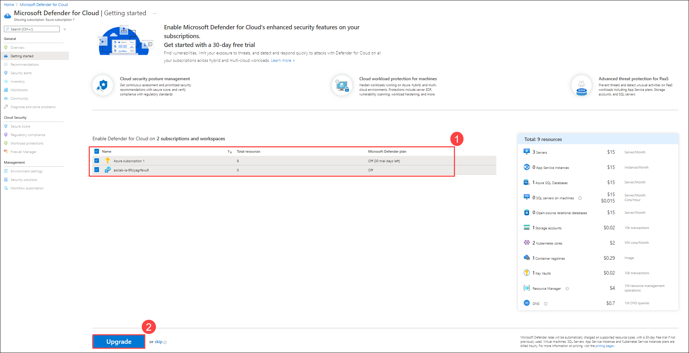

# Module 0 – Preparing the Environment

## Prerequisites
Before you start this lab, make sure you have the following prerequisites:
- **Supported web browser** (Microsoft Edge, Google Chrome, Safari, Firefox Mozilla)
    - For using these labs, **we recommend to open an incognito/in-private browser session** on your machine and login to Azure Portal to avoid conflicts with existing Azure Subscriptions/environments if already being used.
 - **Microsoft Account** - If you do not have an existing account Sign-up to create a free account: https://signup.live.com

## Provision Resources

1. Prepare your lab environment by clicking on the blue **Deploy to Azure** button below:
   

2.	You will be redirected to Azure Portal > custom deployment page where you should specify mandatory fields for deployment.
3.	On the subscription field, select **Azure subscription 1**.
4.	On the resource group field, click on **Create new** and name it as **asclab** (you can pick any name you want or keep the default).
5.	On the parameters section, select the closest data center **region** to your current location (all downstream resources will be created in the same region as the resource group).
6. Select a password that will be used across services (such as credentials for virtual machines and SQL database)
> Notice that password must be between 12 and 72 characters and have 3 of the following: 1 lower case, 1 upper case, 1 number and 1 special character.
7.	Click **Review + create** to start the validation process. Once validation passed, click on **Create** to start the ARM deployment on your subscription.
8.	The deployment takes about **10 minutes** to complete. 

> The *deployment is in progress* page continues to update and show the resources being uploaded to the environment assuming the deployment is successful.  
> During the deployment, additional resource group will be created automatically for Kubernetes resources named as “asclab-aks”. 

You can also check the progress of your deployment if you click on your created resource group details, then click on **Deployments** (*1 deploying*).  

When the deployment is complete, you should see the following:

## Enabling Microsoft Defender for Cloud

#### Subscription upgrade and agents installation
1. Open **Azure Portal** and navigate to **Microsoft Defender for Cloud** blade.

2. Click on **Getting started** page from the left pane, On the **Upgrade** Tab, select subscription (Azure subscription 1) and press **Upgrade**.

   >Note: You may need to wait for a few minutes for the upgrade to complete.

4. Select both **Azure subscription 1**, and also the **workspace name** underneath it. Click on **Upgrade** to upgrade.

   

5. Select the **Azure Subscription 1** and click **Install agents** to install agents to the resources in the subscription.

   

#### Get the status of the Defender coverage on the subscription and the workspace
1. Return to Microsoft Defender for Cloud blade and Click on **Environment settings**. Click the down arrow on **Azure** to show the subscription, and then click the down arrow on **Azure Susbcription 1** to show the workspace. Notice the Defender coverage is 11/11 plans for the subscription and 2/2 plans for the workspace, meaning that you are now fully protected using Microsoft Defender for Cloud.
    

2. Click on **Azure subscription 1**, and notice how all Microsoft Defender for Cloud plans are enabled. 

> If you need to enable individual plans, first ensure that the Microsoft Defender for Cloud plans blue box on the right hand side is selected, and then you can select the specific Defender plans underneath.

3. Exit that screen, and then select the workspace from the previous screen. 
   
    

4. Ensure that plans for **Servers** and **Databases** are turned **On**. To check for **SQL servers on machines**, in Databases, click on **Select types** and make sure **SQL servers on machines** is toggled **On**. **Azure SQL Databases** should be toggled **On** too. 

#### Configure the data collection settings in Microsoft Defender for Cloud

1. Go back to the **Environment settings** in the sidebar and drill down into your **Azure subscription** (Azure subscription 1).
2. Navigate to **Auto provisioning**

3. On the **Auto provisioning - Extensions** page, set **Log Analytics agent/Azure Montior agent** to **On** (if it's not already set to On)
4. Click **Edit configuration** under the configuration column.
5. On the workspace configuration section, use the **Custom workspace** option to select your workspace **asclab-xxx** (which has been created by the ARM template).
6. Under **Security events storage** section, select **All Events** option.

7. Click on **Apply**.
8. Click on **Save**.

 

> Please notice:
> * To get the full functionality of Microsoft Defender for Cloud, both subscription and Log Analytics workspace should be enabled for Microsoft Defender for Cloud, Once you enable it, under the hood the required Log Analytics solutions will be added to the workspace.
> * Before clicking on the Upgrade button, you can review the total number of resources you are going to enable Microsoft Defender for Cloud on.
> * You can enable Microsoft Defender for Cloud trial for 30-days on a subscriptions only if not previously used.
> * To enable Microsoft Defender for Cloud on a subscription, you must be assigned the role of Subscription Owner, Subscription Contributor, or Security Admin.

### Continue with the next module: [Module 1 - Defender for Cloud Walkthrough](../Modules/Module1:MDCWalkthrough.md)
