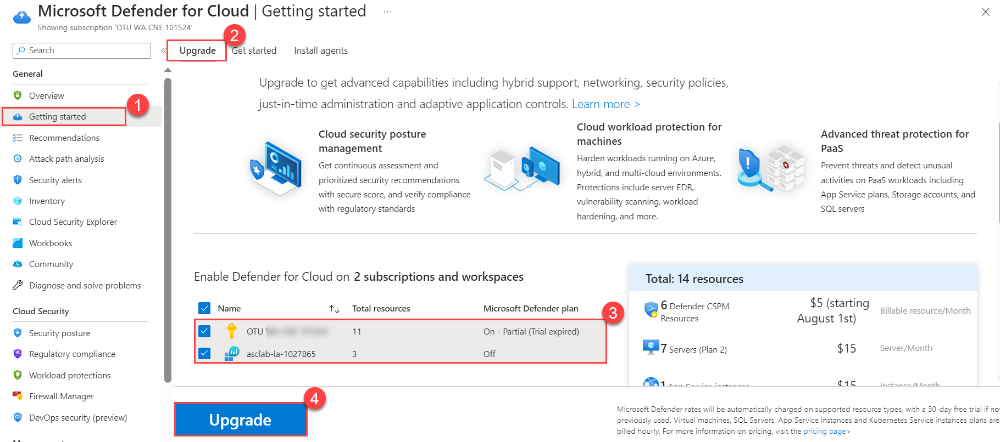
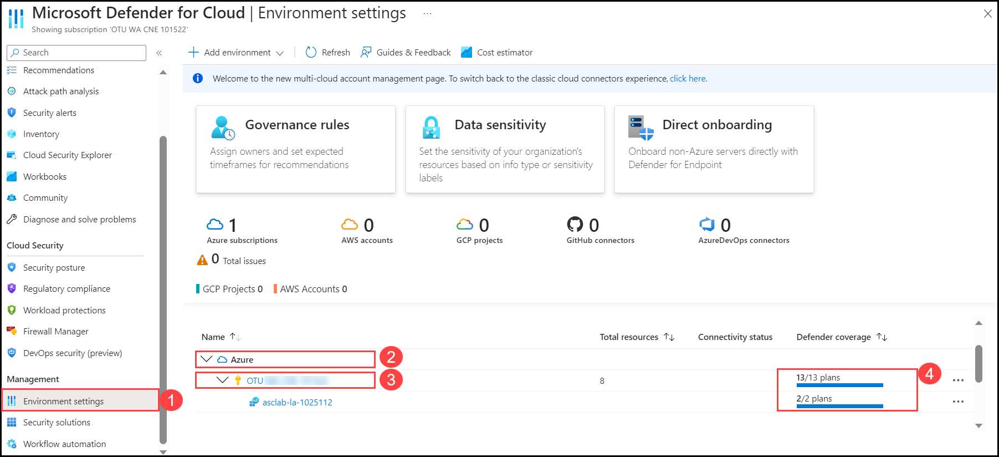
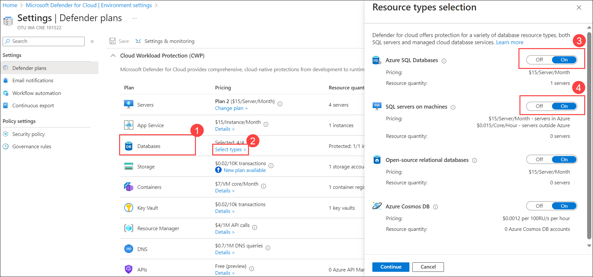

# Module 0 – Preparing the Environment

## Task 1 : Enabling Microsoft Defender for Cloud(Read-Only)

1. Open **Azure Portal** and search for **Microsoft Defender for Cloud (1)** and then click on it from the search results **(2)**.

      

2. Click on **Getting started (1)** page from the left pane, On the **Upgrade (2)** Tab, select both **Azure subscription (3)**, and also the **Workspace name** underneath it. Click on **Upgrade (4)**.

    >**Note:** You may need to wait for a few minutes for the upgrade to complete.

   

3. On the **Install Agents (1)** tab, select the **Subscription (2)** and click **Install agents (3)** to install agents to the resources in the subscription.

   

## Task 2 : Get the status of the Defender coverage on the subscription and the workspace

1. Navigate back to Microsoft Defender for Cloud blade, and Click on **Environment settings (1)**. Expand **Azure (2)** to show the **Subscription**, and then expand **Subscription (3)** to show the **Workspace**. Notice the Defender coverage is **13/13 plans  (4)** for the subscription and **2/2 plans** for the workspace, meaning that you are now fully protected using Microsoft Defender for Cloud.

   

2. From the Environment settings, click on **Subscription (1)**, and notice how all Microsoft Defender for Cloud plans are enabled. 

   

3. Ensure that plans for **Servers** and **Databases (1)** are turned **On**. To check for **SQL servers on machines**, in databases, click on **Select types (2)** and make sure **SQL servers on machines (3)** and **Azure SQL Databases (4)** are toggled **On**.

   

## Task 3 : Configure the data collection settings in Microsoft Defender for Cloud(Read-Only)

1. Go back to the **Environment settings** in the sidebar and drill down into your **Subscription (1)**.

   

2. Navigate to **Settings and monitoring (1)**.

    

3. On the **Settings and monitoring - Extensions** page, set **Log Analytics agent/Azure Montior agent (1)** to **On (2)** (if it's not already set to On). Then 
 click on **Edit configuration (3)** under the configuration column.

   

5. On the workspace configuration section, in the **Custom workspace** option, verify your workspace **asclab-xxxxx (1)** is present. Click on **Apply (3)** and **Continue (4)**.

   

8. Click on **Save**.

   
