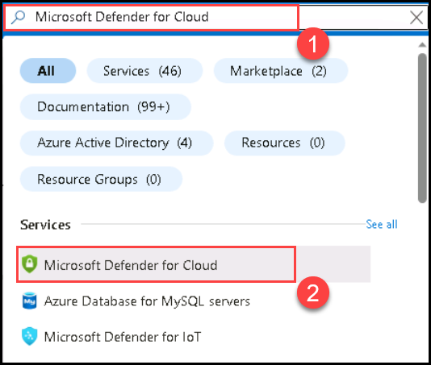
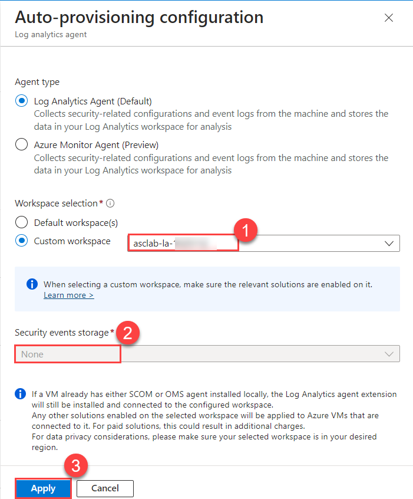

# Module 0 – Preparing the Environment

## Prerequisites

Before you start this lab, make sure you have the following prerequisites:

- **Supported web browser** (Microsoft Edge, Google Chrome, Safari, Firefox Mozilla)
    - For using these labs, **we recommend to open an incognito/in-private browser session** on your machine and login to Azure Portal to avoid conflicts with existing Azure Subscriptions/environments if already being used.
      
 - **Microsoft Account** - If you do not have an existing account Sign-up to create a free account: https://signup.live.com

## Task 1 : Enabling Microsoft Defender for Cloud(Read-Only)

#### Subscription upgrade and agents installation

1. Open **Azure Portal** and search for **Microsoft Defender for Cloud(1)** and then click on it from the search results (2).

      

2. Click on **Getting started(1)** page from the left pane, On the **Upgrade(2)** Tab, select both **Azure subscription(3)**, and also the **Workspace name** underneath it. Click on **Upgrade(4)**.

    >**Note:** You may need to wait for a few minutes for the upgrade to complete.

   

3. On the **Install Agents(1)** Tab, select the **Subscription(2)** and click **Install agents(3)** to install agents to the resources in the subscription.

   

## Task 2 : Get the status of the Defender coverage on the subscription and the workspace

1. Navigate back to Microsoft Defender for Cloud blade, and Click on **Environment settings(1)**. Click the drop down arrow on **Azure(2)** to show the subscription, and then click the drop down arrow on **Subscription(3)** to show the **workspace**. Notice the Defender coverage is **13/13 plans(4)** for the subscription and **2/2 plans** for the workspace, meaning that you are now fully protected using Microsoft Defender for Cloud.

   

2. From the Environment settins, click on **Subscription(1)**, and notice how all Microsoft Defender for Cloud plans are enabled. 

   

3. Ensure that plans for **Servers** and **Databases(1)** are turned **On**. To check for **SQL servers on machines**, in Databases, click on **Select types(2)** and make sure **SQL servers on machines(3)** and **Azure SQL Databases(4)** are toggled **On**.

   

## Task 3 : Configure the data collection settings in Microsoft Defender for Cloud(Read-Only)

1. Go back to the **Environment settings** in the sidebar and drill down into your **Subscription**.
2. Navigate to **Settings and monitoring**
3. On the **Settings and monitoring - Extensions** page, set **Log Analytics agent/Azure Montior agent(1)** to **On(2)** (if it's not already set to On)
4. Click **Edit configuration(3)** under the configuration column.

   

5. On the workspace configuration section, use the **Custom workspace** option to select your workspace **asclab-xxxxx(1)** (which has been created by the ARM template).
6. Under **Security events storage** section, select **None(2)** option.
7. Click on **Apply(3)** and **Continue(4)**.

   

8. Click on **Save**.

 

> Please notice:
> * To get the full functionality of Microsoft Defender for Cloud, both subscription and Log Analytics workspace should be enabled for Microsoft Defender for Cloud, Once you enable it, under the hood the required Log Analytics solutions will be added to the workspace.
> * Before clicking on the Upgrade button, you can review the total number of resources you are going to enable Microsoft Defender for Cloud on.
> * You can enable Microsoft Defender for Cloud trial for 30-days on a subscriptions only if not previously used.
> * To enable Microsoft Defender for Cloud on a subscription, you must be assigned the role of Subscription Owner, Subscription Contributor, or Security Admin.

### Continue with the next module: [Module 1 - Defender for Cloud Walkthrough](../Modules/Module1:MDCWalkthrough.md)
