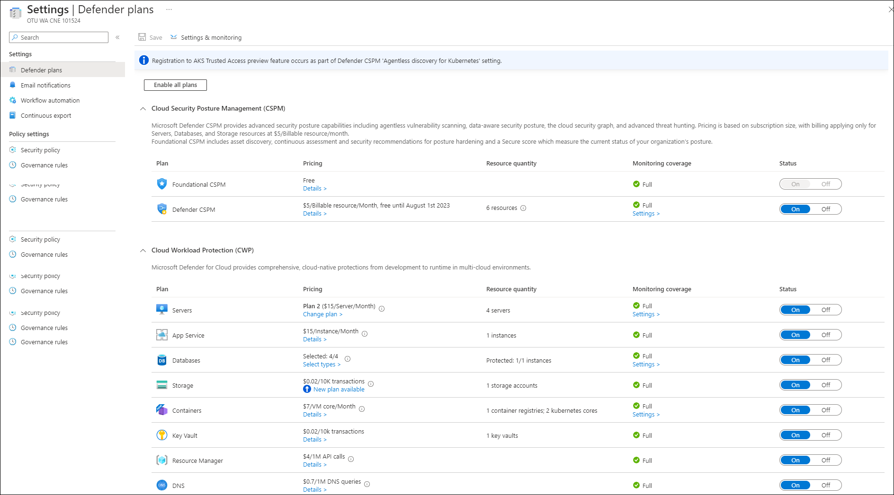
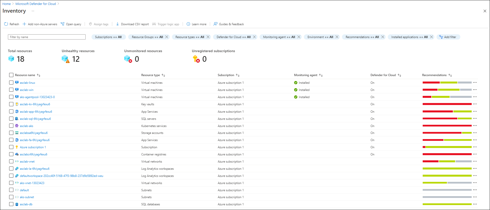
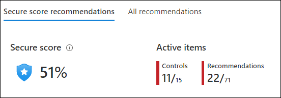

# Module 1 - Exploring Microsoft Defender for Cloud

## Task 1: Understanding Microsoft Defender for Cloud dashboard 

1. Open **Azure Portal** and search for **Microsoft Defender for Cloud (1)** and then click on it from the search results **(2)**.

       

2.	On the **Overview (1)** blade notes that it now provides a unified view into the security posture and includes multiple independent cloud security pillars such as **Security posture, Regulatory compliance, Workload protections, Firewall Manager, Inventory, and Information protection (preview) (2)**. Each of these pillars also has its own dedicated dashboard allowing deeper insights and actions around that vertical, providing easy access and better visibility for security professionals.

   	> **Info**: Microsoft Defender for Cloud takes time to populate information such as secure score, compliance, recommendations etc. after enabling the services and enrolling the servers to Microsoft Defender for Cloud.
 
      

3. Note that  the **top menu** bar allows to view and filter subscriptions by selecting the **subscriptions button**. In this lab we will use only one but selecting different/additional subscriptions will adjust the interface to reflect the security posture for the selected subscriptions.

     

4. Click on the **What’s new** button – a new tab opens with the latest release notes where you can stay current on the new features, bug fixes and more.

      
	
 5. Note the **high-level numbers** at the top menu; This view allows you to see a summary of your subscriptions, active recommendations, security alerts alongside with connected cloud accounts.

     

6. From the top menu bar, **click** on **Azure subscriptions**. 

   	

  	- This will bring you into the environment settings. Then select the available subscription. 

   	

7. On the **Defender plans** page, note that your subscription is fully covered – means that your subscription is covered by Microsoft Defender for Cloud. 	

   	

     > **Info**: This page shows a list of subscriptions and their coverage type. You can use this page to find subscriptions that are not covered by Microsoft Defender for Cloud and help you identify “shadow IT” subscriptions.

8. Go back to the **Overview** page, and look at the **Secure Posture** tile, you can see your current score along with the number of completed controls and recommendations. Clicking on this tile will redirect you to drill down view across subscriptions.

   	

     > **Info**: The higher the score, the lower the identified risk level.

9. On the **Regulatory Compliance** tile, you can get insights into your compliance posture based on continuous assessment of your both Azure and hybrid cloud environments. This tile shows only 4 standards which are SOC TSP, ISO 27001, PCI DSS 3.2.1 and Azure CIS 1.1.0. Clicking on this tile will redirects you to **Regulatory Compliance** dashboard – where you can add additional standards and explore the current ones.

10. On the **Workload Protections** tile, you can see the coverage of your connected resources (for the currently selected subscriptions) and the recent alerts, color-coded by severity. Your current resource coverage should be **100% which means full protection**. Clicking on this tile will redirects you Microsoft Defender for Cloud dashboard.

11. On the **Inventory** tile, you are provided with a view of your security posture across all your inventory, including Defender coverage per resource and whether the monitoring agent is installed.

       

## Task 2: Exploring Secure Score and Recommendations 

**Exploring Secure Score**

Previously, we briefly explored the Secure Score tile on the overview page. Now let’s dive into this capability and the associated recommendations. Microsoft Defender for Cloud continually assesses your resources. All findings are aggregated into a single score (Secure Score) which measures your current security posture of your subscription; the higher the score, the lower the identified risk level.

1. In the **Microsoft Defender for Cloud Overview blade**. From the left navigation pane, under the **Cloud Security** section, press on the **Secure posture** button.

     

2. On the Secure Score page, **review your current overall secure score percentrage**.

	> **Note**: Your score is shown as a percentage value, but you can also see the number of points which the score is being calculated based on. 

    

   > For more information on how the score is calculated, [refer to the secure score documentation page](https://docs.microsoft.com/en-us/azure/security-center/secure-score-security-controls#how-your-secure-score-is-calculated).

5. On the bottom part, you can see a list of subscriptions and their current score. To view the recommendations behind the score, click on **view recommendations**.

## Task 3: Exploring Security Controls and Recommendations 

1. On the **Recommendations (1)** page, pay attention to the first part of the page; the **summary view (2)** which includes the current score, progress on the recommendations (both completed security controls and recommendations) and resource health (by severity).

    

2. On the top menu, click on **Download CSV report** button – this allow you to get a snapshot of your resources, their health status and the associated recommendations. You can use it for pivoting and reporting.

     

3. Under **Recommendation**, Click on **Manage access and permissions** and select **Storage account public access should be disallowed** from the drop down list.

     

4. On the top section, notice the following:

   - Title of the recommendation: **Storage account public access should be disallowed**
   - Top menu controls: **Exempt**, **Deny**, **View policy definition** and **Open query**
   - Severity indicator: **Medium**
   - Freshness interval: **30 Min** 
   - Tactics and techniques: **Initial Access**

    

5. The next important part is the **Remediation Steps** which contains the remediation logic where you can remediate the selected resource/s.

6. Under **Affected resources**, **select a resource** (the single **storage account** on the Unhealthy resources) and click on **Fix**. This will automatically apply the remediation on the selected resource.

     
  
11. This will open a new window - **Fixing resources**, review the implications for this remediation and click on **Fix 1 resource**.

     
  
12. Wait for a notification: ✅ **Remediation successful** - Successfully remediated the issues on the selected resources. 
    
    > **Note**: It can take several minutes after remediation completes to see the resources in the 'healthy resources' tab. You can move to next task and come back later to check on this.

    > **Info**: In the recommendation list, you can now see some recommendations flagged as in preview. They aren’t included in the calculation of your score. They should be still remediated so that when the preview period ends, they will contribute towards your final score.

### Exploring the Inventory capability

Asset inventory dashboard allows you to get a single pane of glass view to all your resources covered by Microsoft Defender for Cloud. It also provides per-resource visibility to all Microsoft Defender for Cloud’s information and additional resource details including security posture and protection status. Since this dashboard is based on Azure Resource Graph (ARG), you can run queries across subscriptions at scale quickly and easily.

1.	From Microsoft Defender for Cloud’s sidebar or from the Overview tile, select **Inventory**
2.	Hover to the top of the page.
3.	Notice the total number of resources: **15**

> ⭐ Notice:  
> The total number of resources are the ones which are connected to Microsoft Defender for Cloud and NOT the total number of resources that you have in your subscriptions/s.

4.	Notice the number of **unhealthy resources: 11** (resources with active recommendations based on the selected filter)
5.	Notice the **unmonitored resources: 0** (indicates if there are resources with Log Analytics agent deployed but with health issues). Since we enabled the auto-provisioning in the previous module, all existing VMs are covered and connected = monitored.
6.	Use the **Filter by name** box to search for **linux**. You should now see a filtered view of the disks in your environments.  Clear the filter.
7.	Open the resource health pane by selecting the resource. Click on **asclab-linux**. 
8.	On the resource health pane for **asclab-linux**, review the virtual machine information alongside with a recommendation list.

9.	Navigate back to the **Inventory page**. From the filter menu, select the **Resource Group** filter and then **asclab-aks**. Using this filter, you can see all resources related to the predefined Kubernetes resources which are monitored with no active recommendations. Clear the filter by selecting **Resource Group** and then **Select all**.

> Notice! The entire grid can be filtered and sorted

10.	From the filter menu, select **Recommendations**, uncheck **select all** option and then select the **Auditing on SQL Server should be enabled**. You can also use the search area within the filter to better find across the list. Clear your filter.
11.	Tag is very common asset management in Azure to do asset management. Using this view, you can assign tags to the filtered resources:

* Filter the **Resource type** column to include only **App Services**.
* **Select** the two app service named as *asclab-fa-xx* and *asclab-app-xx*
* From the top menu, click **Assign tags**
* Assign `Environment` as the name and  `Production` as the value.
* Click **Save**.

12. Click on **Add filter**.Notice the **Security findings** filter – it allows you to find all resources that are vulnerable by a specific vulnerability. You can also search for CVE, KB ID, name and missing update.
13. From the **Resource Group** filter, select **asclab**. From the top menu bar, click on **Download CSV report**. You will get a snapshot to work on it offline already filtered. You can also right click on any of the resource and upgrade to Workload Protections plan (when applicable).
14.	From the top menu, click on **open query**. This will open up the resource graph explorer blade, click on **Run Query**. You should now have the same list of resources and columns like in the previous step. This query can be editable for your needs and here it gets very powerful.
15. Save the query for later use by clicking on **Save as** from the top menu. You can use it to create periodic reports. Name the report as *asc-filtered-query* and select **Save**.

> ⭐ Good to know:  
> Inventory dashboard is fully built on top of Azure Resource Graph (ARG) which stores all of ASC security posture data and leveraging its powerful KQL engine.
> It enables you to reach deep insights quickly and easily on top of ASC data and cross reference with any other resource properties.

# Understanding pricing

The pricing criteria depends on the plan you enable. Navigate to ***Pricing Page*** (https://azure.microsoft.com/en-us/pricing/details/defender-for-cloud/?v=17.23h)

In addition, as a part of Foundational CSPM (free) you get several items like Secure Score, Asset Inventory, Security Recommendations etc. free of charge. Let's review the ***Foundational CSPM vs. Defender CSPM capabilities*** (https://learn.microsoft.com/en-us/azure/defender-for-cloud/concept-cloud-security-posture-management)

In addition you can leverage ***Cost Estimation*** workbook to plan for spend

### Continue with the next module: [Module 2 - Proactively protecting cloud attack suraface with Microsoft Defender for Cloud](../Modules/Module2:UnderstandingYourCloudAttackSurface.md)
