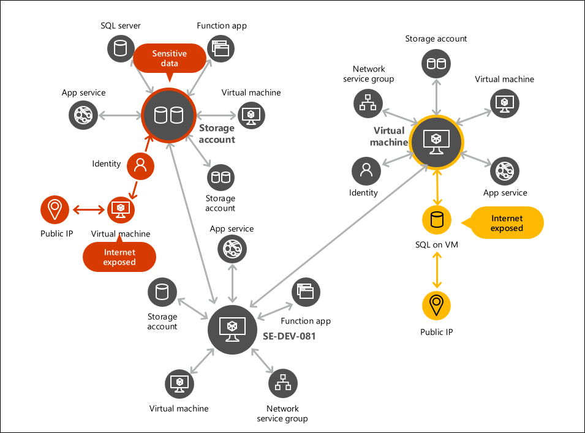

# Module C - Understanding your Cloud Attack Surface
 
As you saw in Module 1, Defender for Cloud CSPM will help you identify weaknesses against best practices based on the workload running in your Azure tenant or subscription. These deviations are presented as recommendations, and we performed a walkthrough of some of them. 

 

In this module, we will learn how you can further extend this capability by generating your own queries to proactively hunt for points of entry to reduce the attack surface and decrease the likelihood of compromise.

## Contextualize cloud posture management

Defender for Cloud contains a graph-based context engine ***cloud security graph***.  The cloud security graph collects data from your multi-cloud environment and other data sources. For example, the cloud asset inventory, connections and lateral movement possibilities between resources, exposure to the internet, permissions, network connections, vulnerabilities, and more. The data collected is then used to build a graph representing your multi-cloud environment.

Defender for Cloud uses the graph to perform an attack path analysis (Attack Paths). You can also use the graph to find the issues with the highest risk that exist within your environment (Cloud Security Explorer).

### Task 1: Identify likely points of entry

1. In Azure Portal, search for **Microsoft Defender for Cloud (1)** and then click on it from the search results **(2)**.

   

2. From the **Defender for Cloud** menu, click on the **Recommendations (1)** blade to see different Attack Paths that Defender has identified. Attack Path looks for points of entries and lateral movement not only in Azure but also in AWS and GCP. Click on the **Attack path (2)**.

   

3. In **Microsoft Defender for Cloud | Attack path analysis** page. Each attack path represents a scenario that you should be aware of. The title **Internet exposed VM has high severity vulnerabilities (1)** itself provides you with a quick understanding of how the risk exposure might manifest, which allows you to quickly prioritize your investigation.

   

5. Select **Internet exposed VM has high severity vulnerabilities and read permission to a Key Vault (1)** under Attack path.

   

6. Notice that you can see that a publicly exposed VM that has a port open to the internet can lead to remote access to the VM. The path also gives you specifics of which VMs are potential targets.

   

   > **Note**: To learn more about any particular Attack Path simply select it and explore it.

7. Select the **VM (1)** in the attack path and click on **Recommendations (2)**. You will see the vulnerabilities and any security recommendations that are relevant to this machine. 

   

8. Select an **Unhealthy** recommendation; you will see the remediation steps, and click on the **Take action** button at the bottom left of the screen. You will see the screen where you can implement these remediations.

   

9. Now you have a complete picture of:
      - What resources can cause potential risk exposure.
      - What is a likely path that leads to exposure.
      - What are the open recommendations for these resources.
      - How to remediate open attack paths.

### Task 2: Building and exploring your own custom risk scenarios

1. From **Defender for Cloud** menu, open the **Cloud Security Explorer** page.

   

1. Let's build our scenario where we will identify public, vulnerable machines that can access object storage.

1. Choose the **Internet exposed VMs with high severity vulnerabilities (1)** template from **Query Templates** and click on **Search (2)**.

   

1. You will see a list of machines that are not only publicly exposed but also vulnerable. Now, let's expand this to identify machines that have permissions to other resources (managed identities). 

1. Click on the **plus (1)** next to Virtual Machines (group), from the drop-down of **select Condition (2)**, select **Networking (3)**, and select **Exposed to the Internet (4)**.

   

1. From the drop-down of **Click on + button (1)** to enable new options, under **Where** select **Port (2)**, and on **Equals** enter **3389 (3)** next to exposed to the internet.

    

1. Then click on the **Search** button, and you will see a list of machines that can be the target of this attack path.

    

**Note:** All the machines shown in the image won't be available.

