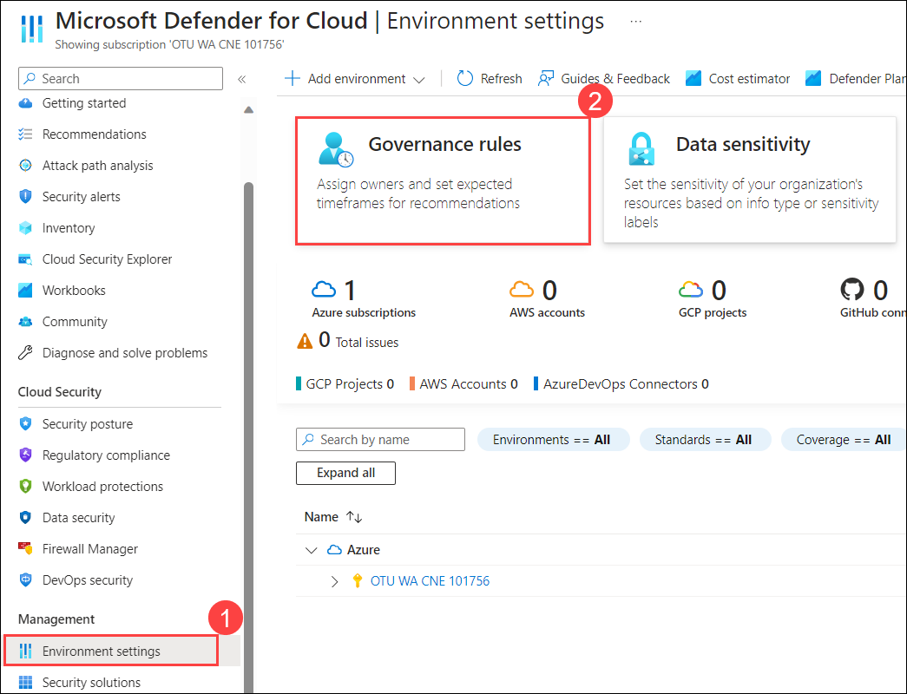
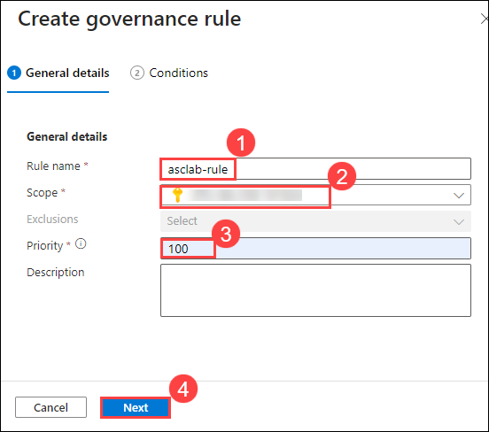

# Exercise 5 - Governance Rule

Governance rules can identify resources that require remediation according to specific recommendations or severities. Microsoft Defender for Cloud continuously assesses your hybrid and multi-cloud workloads and provides you with recommendations to harden your assets and enhance your security posture.
Central security teams often experience challenges when driving the personnel within their organizations to implement recommendations. 
The rule assigns an owner and due date to ensure the recommendations are handled. Many governance rules can apply to the same recommendations, so the rule with a lower priority value is the one that assigns the owner and due date. Governance rules will help:

- **Security teams**: Set accountability for recommendations, track their progress, and drive resource owners to action with notification capabilities.

- **Workload owners**: Focus on the specific recommendations that require their attention. They'll also be able to delegate recommendations to others or set expectations for when the recommendations will be implemented.

### Task 1: Assign Governance Rule

1. From the **Defender for Cloud** menu, click on **Environment Settings (1)** page and click on **Governance rules (2)**.

    

3. Click on **+ Create governance rule**.

    

4. Enter **Rule name** as `asclab-rule` **(1)**, select **Scope** at subscription level **(2)** and **Priority** `100` **(3)**. Click **Next (4)**.

    
    
5. Under **conditions** provide the below details and click **Create (5)**
	
   - **By severity**: `High` **(1)**
   - **Owner**: `By email address` **(2)**
   - **Email address**: <inject key="AzureAdUserEmail"></inject> **(3)**
   - **Remediation timeframe**: `90 days` **(4)**

        

6. On the **Rule created successfully** pop-up select the check box next to **Apply rule to the 42 existing recommendations that are unassigned** and click on **OK**.

    

7. Click on **Governance report** to view the status of tasks **Complete, Ontime and Unassign**.

    
    
    

   > **Congratulations** on completing the task! Now, it's time to validate it. Here are the steps:
   > - Navigate to the Lab Validation Page, from the upper right corner in the lab guide section.
   > - Hit the Validate button for the corresponding task. If you receive a success message, you can proceed to the next task. 
   > - If not, carefully read the error message and retry the step, following the instructions in the lab guide.
   > - If you need any assistance, please contact us at labs-support@spektrasystems.com. We are available 24/7 to help you out.

